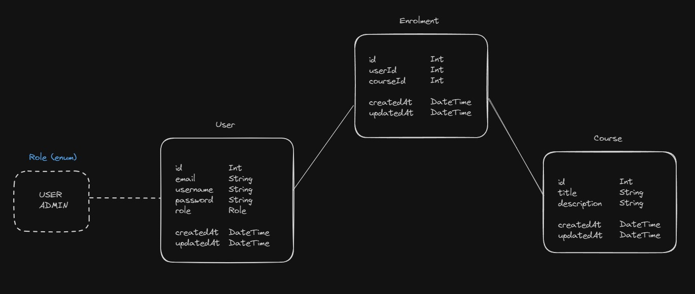
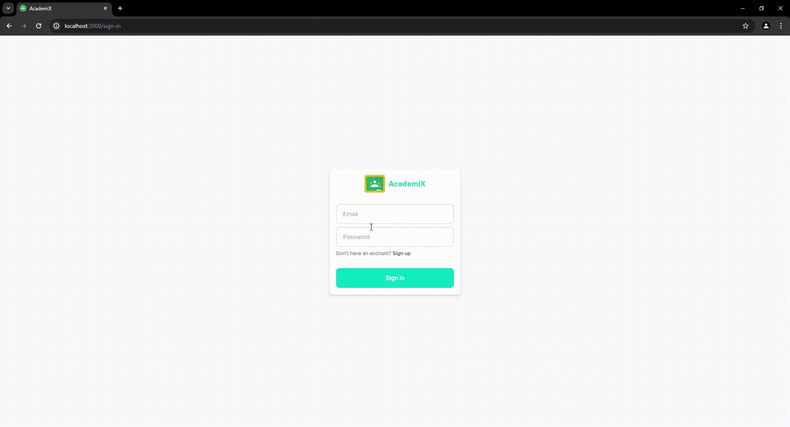
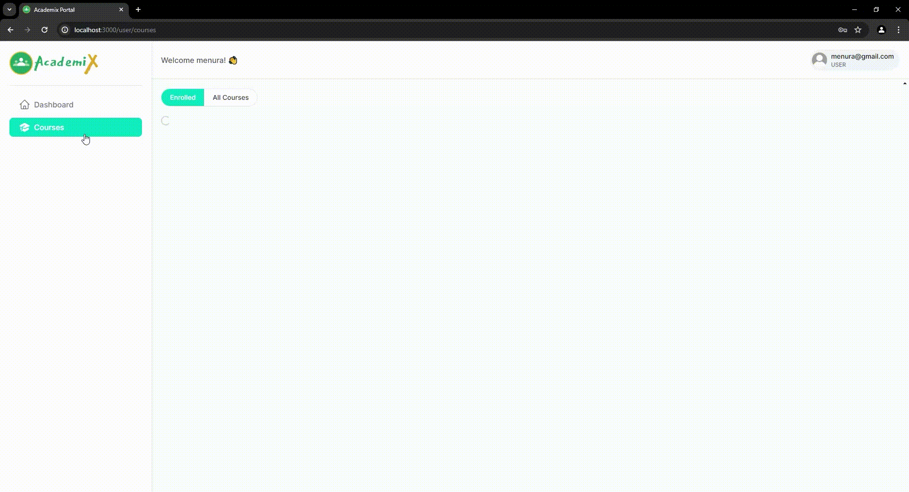
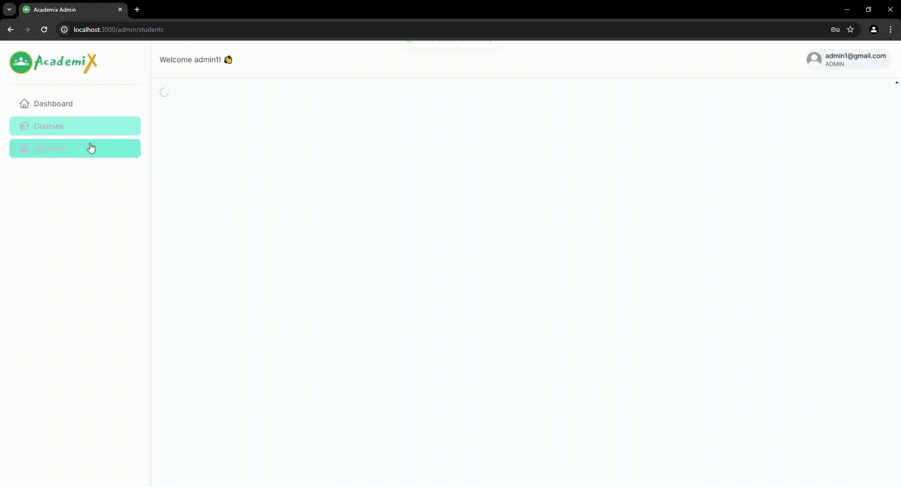

# AcademiX


AcademiX is a learning management system (LMS) designed to facilitate online education by allowing users to enroll in courses and access course materials.

## Features

- User authentication and roles (USER, ADMIN)
- Course management
- Enrollment management

## Installation

1. Clone the repository:

```bash
git clone https://github.com/yourusername/academix.git
cd academix
```

2. Install the dependencies:

```bash
npm install or yarn install
```

3. Set up the environment variables:

```bash
DATABASE_URL="postgresql://{{username}}:{{password}}@{{ip}}:{{port}}/{{db}}?schema=public"
NEXTAUTH_SECRET="{{base64_32bit}}"
```

4. Set up the database:

```bash
npx prisma migrate dev --name {{migration_name}}
npx prisma generate
```

## Running the Application

1. Development:

```bash
npm run dev or yarn dev
```

1. Production:

```bash
npm run build or yarn build
```

## Schema



## Demo

User Authentication


Course and Enrollment Management



Student Management


## License

This project is licensed under the MIT License. See the LICENSE file for details.
